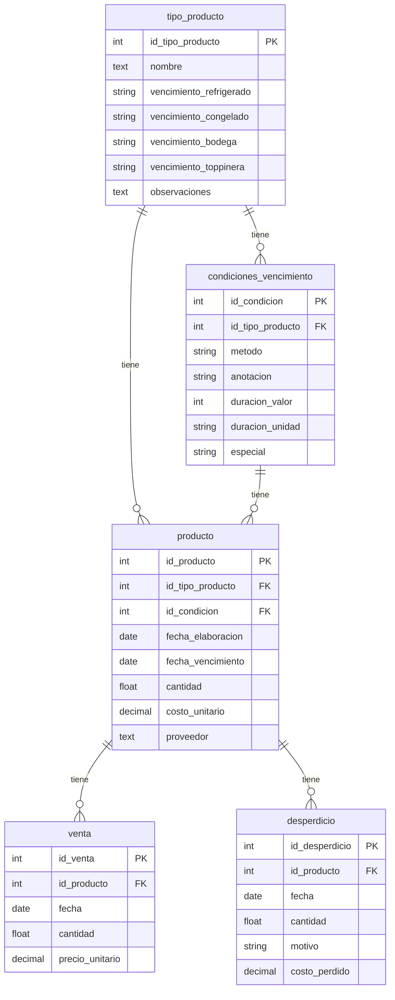

# Arquitectura — ¿Cuándo Vence?

## Estilo arquitectónico

Monolito modular con frontend y backend separados:

- **Backend**: Django 6.0.5 + DRF, **API-only** (no renderiza templates propios).
- **Frontend**: SPA React 19 + Vite + React Router, **única fuente de HTML**.
- **Base de datos**: SQLite3 (`src/backend/db/vencimientos.db`, con datos reales de producción).
- Comunicación solo vía **API REST en `/api/`** con autenticación por **token**.

## Topología de ejecución

### Producción / uso diario — un solo servidor

```
Browser ── http://127.0.0.1:8000/ ──▶ Django
                                        ├─ /               → index.html (build de Vite)
                                        ├─ /assets/*       → JS/CSS del build
                                        ├─ /api/*          → API REST (DRF)
                                        └─ /admin/         → admin de Django
```

- `npm run build` genera `src/frontend/dist/`; Django lo sirve vía `FRONTEND_DIST` (templates + static).
- **Un solo comando**: `python manage.py runserver` desde `src/backend`.
- La máquina del local no necesita Node ni Vite.

### Desarrollo — dos servidores (con HMR)

```
Browser ── http://localhost:5173 ──▶ Vite (HMR)
                │ /api/* (proxy)
                └──────────────────▶ Django :8000 (solo API)
```

- Vite (5173) con Hot Module Replacement; proxea `/api` a Django (ver `vite.config.js`).
- Útil mientras se desarrolla el frontend; en producción no se usa.

## Capas del backend (`src/backend/`)

```
HTTP → urls.py (controlStock)
        ├─ /api/* → Inventory/api.py → serializers.py → models.py → SQLite
        ├─ /admin/ → Django admin (usa sus propios templates)
        └─ / (+ catch-all SPA) → controlStock/views.py → index.html del dist
```

| Archivo | Responsabilidad |
|---|---|
| `controlStock/settings.py` | Config, BD, `FRONTEND_DIST`, DRF (solo Token + Basic) |
| `controlStock/urls.py` | Routing raíz; catch-all SPA (excluye `/api/`, `/admin/`, `/assets/`) |
| `controlStock/views.py` | `spa` (sirve `index.html`), `favicon` |
| `Inventory/models.py` | 5 modelos + `calcular_fecha_vencimiento()` (cálculo en `save()` de Producto) |
| `Inventory/api.py` | 5 viewsets read-only + `login_api` + `me` + `metricas` |
| `Inventory/serializers.py` | Serialización (tipos incluyen `condiciones`, productos incluyen `condicion`) |
| `Inventory/admin.py` | Registro de modelos en el admin |

### Modelo de datos

```
TipoProducto 1──N CondicionVencimiento
     │ 1                │ 1
     │                  │
     └────── N Producto ┘   (lote físico: tipo + condición + fecha elaboración)
                 │ 1
                 ├──N Venta
                 └──N Desperdicio
```

Diagrama entidad-relación (generado desde los modelos Django con `src/backend/tools/gen_diagrama_er.py`; fuente: [`diagrama-er.mmd`](./diagrama-er.mmd)):



- `TipoProducto` = catálogo (nombre único). Los campos `vencimiento_*` son legacy (solo referencia); la fuente de verdad vive en `CondicionVencimiento`.
- `Producto.save()` calcula `fecha_vencimiento` automáticamente desde su condición.
- `metricas` agrega ventas/desperdicios por producto (rendimiento, ganancia).

### Autenticación

- `POST /api/auth/login/` → usuario + password → devuelve token (DRF authtoken).
- El resto de `/api/` exige `Authorization: Token <token>`.
- **Sin `SessionAuthentication` a propósito**: con frontend y backend en el mismo origen, el browser manda la cookie de sesión y DRF exigiría CSRF en `/api/` (ver gotchas en `src/backend/README.md`).
- `/admin/` usa sesiones de Django por su cuenta (no pasa por DRF).

## Capas del frontend (`src/frontend/`)

```
main.jsx → App.jsx (Router + layout)
            ├─ pages/       → HomePage, InventoryPage, RotulosPage
            ├─ components/  → Navbar, Footer, DataCell, ProtectedRoute
            ├─ context/     → AuthContext (token + user en localStorage)
            └─ api/client.js → fetch centralizado (inyecta el token)
```

### Flujos principales

1. **Login**: `HomePage` → `POST /api/auth/login/` → `AuthContext.login()` guarda `{token, user}` en `localStorage` → navega a `/inventario`.
2. **Inventario**: `InventoryPage` → `GET /api/tipos/?search=` → tabla de tipos con condiciones.
3. **Rótulos**: `RotulosPage` → elige tipo + fecha de elaboración + condición → calcula vencimiento en el browser → "carrito" de rótulos (aún sin persistencia en backend).
4. **Logout**: `AuthContext.logout()` borra `localStorage` (client-side; no hay endpoint).

## Decisiones de arquitectura (ADRs resumidos)

1. **Eliminar el frontend MPA legacy** (templates Django `home/inventario/rotulos`, app `core`, `static/`): duplicaba al SPA y dividía la lógica en dos lugares. Django quedó API-only.
2. **Un solo servidor en producción (opción 2)**: Django sirve el build de Vite. Pensado para el uso diario en la cafetería: un proceso, un puerto, sin Node.
3. **Token auth sin sesiones en la API**: evita el conflicto CSRF del mismo origen; el admin conserva sesiones.
4. **SQLite**: suficiente para un solo local con pocos usuarios concurrentes; la DB viaja con el proyecto.

## Restricciones y notas

- `db/vencimientos.db` tiene datos reales: no borrar/resetear sin necesidad (backup: `db/vencimientos_backup_2026-06-24.db`).
- Locale `es-ar`; `CORS_ALLOW_ALL_ORIGINS = True` (solo dev).
- `dist/` está gitignoreado: en cada deploy hay que correr `npm run build`.
- Scripts de un solo uso (`tools/`): `migrar_vencimientos.py` (ya ejecutado 2026-06-24); `inspect_venc.py` solo lectura.
